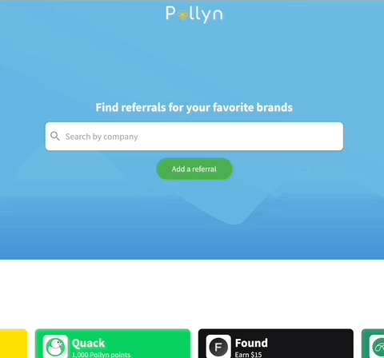
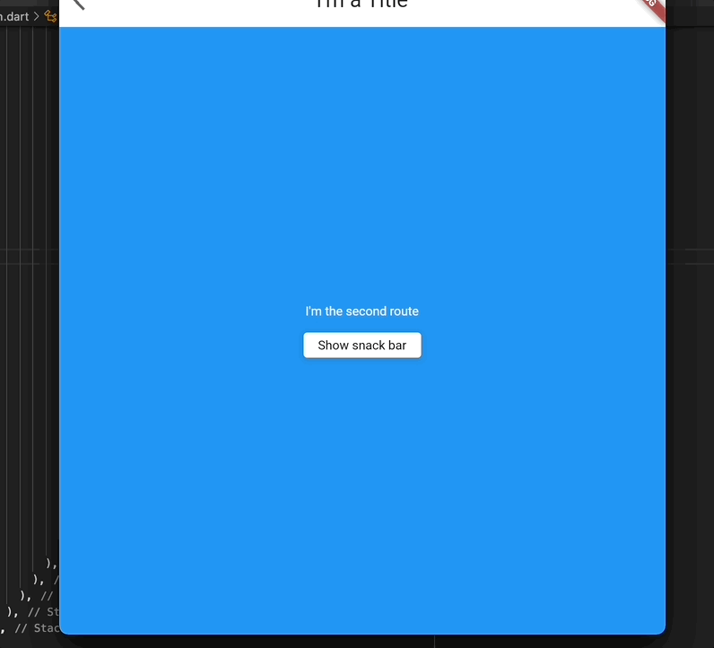
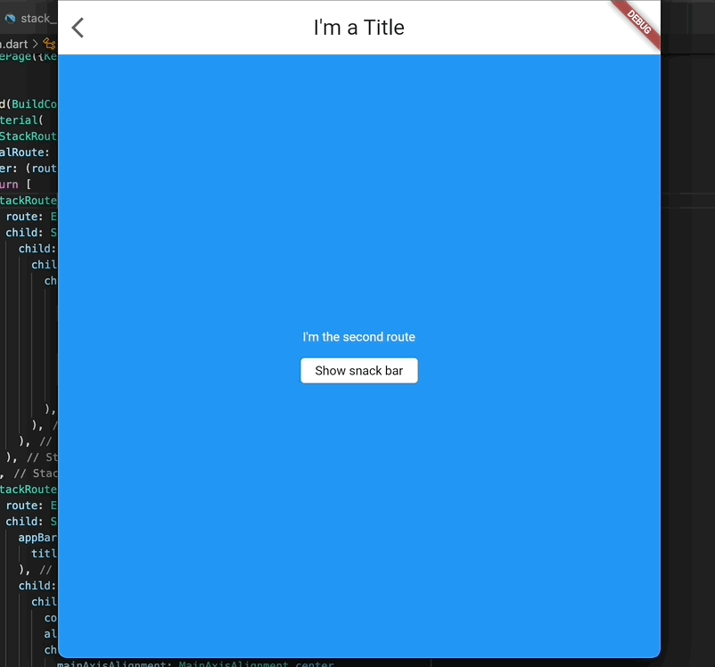

# Stack router

A stack-based routing library using an [IndexedStack](https://api.flutter.dev/flutter/widgets/IndexedStack-class.html) to route between different widgets. Includes its own [Scaffold](https://github.com/danReynolds/stack_router/blob/master/lib/stack_router_scaffold.dart), [App bar](https://github.com/danReynolds/stack_router/blob/master/lib/stack_router_app_bar.dart) and [Snack bar](https://github.com/danReynolds/stack_router/blob/master/lib/stack_router_snack_bar.dart) implementation.

.

## Usage

```dart
import 'package:stack_router/stack_router.dart';

class ExampleStackRoutes {
  static const String firstRoute = 'firstRoute';
  static const String secondRoute = 'secondRoute';
}

class Home extends StatelessWidget {
  const Home({Key? key}) : super(key: key);

  @override
  Widget build(BuildContext context) {
    return Material(
      child: StackRouter(
        initialRoute: ExampleStackRoutes.firstRoute,
        builder: (router) {
          return [
            StackRoute(
              route: ExampleStackRoutes.firstRoute,
              child: Center(
                child: ElevatedButton(
                  onPressed: () {
                    router.pushRoute(ExampleStackRoutes.secondRoute);
                  },
                  child: const Text(
                    "Go to second route",
                    style: TextStyle(color: Colors.white),
                  ),
                ),
              ),
            ),
            StackRoute(
              route: ExampleStackRoutes.secondRoute,
              child: StackRouterScaffold(
                appBar: const StackRouterAppBar(
                  title: Text("I'm a Title", style: TextStyle(fontSize: 24)),
                ),
                child: Container(
                  color: Colors.blue,
                  alignment: Alignment.center,
                  child: Column(
                    mainAxisAlignment: MainAxisAlignment.center,
                    children: [
                      const Text(
                        "I'm the second route",
                        style: TextStyle(
                          color: Colors.white,
                        ),
                      ),
                      const Padding(padding: EdgeInsets.only(top: 16)),
                      ElevatedButton(
                        style: ButtonStyle(
                          backgroundColor:
                              MaterialStateProperty.all(Colors.white),
                        ),
                        onPressed: () {
                          router.showSnackBar(
                            snackBar: const StackRouterSnackBar(
                              title: Text(
                                "I'm a snackbar!",
                                style: TextStyle(color: Colors.white),
                              ),
                            ),
                          );
                        },
                        child: const Text(
                          "Show snack bar",
                          style: TextStyle(color: Colors.black),
                        ),
                      ),
                    ],
                  ),
                ),
              ),
            ),
          ];
        },
      ),
    );
  }
}
```

To see it in action, try running the [example](./example).

## Persist routes

Stack routers are useful when you want to build flows with a pre-defined set of routes. It works by providing the widgets for your routes to an [IndexedStack](https://api.flutter.dev/flutter/widgets/IndexedStack-class.html) and switches the index to the current route. Because it uses an `IndexedStack`, it has some interesting properties like the ability to warm up and persist routes:

```dart
StackRoute(
  route: ExampleStackRoutes.secondRoute,
  persist: true,
  child: Center(
    child: const Text(
      "Second route",
      style: TextStyle(color: Colors.white),
    ),
  ),
);
```

By default a route in the stack router is not built until it has been pushed on. If you want to warm up a particular route that you know fetches data or takes time to build, you can specify `persist=true` on the route so that even if it hasn't been shown to the user yet, it will build itself ahead of time when the [StackRouter] builds and be ready for users when they later navigate to it.

By default, all routes in the current [StackRouter] history are persisted so that when you push on a 2nd route and pop back to the first, it is still the same widget and has maintained all the temporal state like any form data or changes the user may have made to the route before navigating away.

## StackRouterActions

Similarly to Flutter Material's [ScaffoldMessenger](https://api.flutter.dev/flutter/material/ScaffoldMessenger-class.html), any child under a [StackRouterScaffold](https://pub.dev/documentation/stack_router/latest/stack_router_scaffold/stack_router_scaffold-library.html) can manipulate the stack router using the [StackRouterActions](https://pub.dev/documentation/stack_router/latest/stack_router_actions/StackRouterActions-class.html) made available by an `InheritedWidget`.

This makes it easy to show snack bars and change routes from your current route.

```dart
class SecondRoute extends StatelessWidget {
  @override
  build(context) {
    return StackRouterScaffold(
      child: Center(
        child: ElevatedButton(
          style: ButtonStyle(
            backgroundColor:
                MaterialStateProperty.all(Colors.white),
          ),
          onPressed: () {
            StackRouterActions.of(context).showSnackBar(
              snackBar: const StackRouterSnackBar(
                title: Text(
                  "I'm a snackbar!",
                  style: TextStyle(color: Colors.white),
                ),
              ),
              actions: [
                TextButton(
                  child: Text('Go back'),
                  onPressed: () {
                    StackRouterActions.of(context).popRoute();
                  }
                )
              ]
            );
          },
          child: const Text(
            "Show snack bar",
            style: TextStyle(color: Colors.black),
          ),
        ),
      ),
    );
  }
}
```

## Snack bars

Stack router snack bars are queued per route.

```dart
class SecondRoute extends StatelessWidget {
  @override
  build(context) {
    return StackRouterScaffold(
      child: Center(
        child: ElevatedButton(
          style: ButtonStyle(
            backgroundColor:
                MaterialStateProperty.all(Colors.white),
          ),
          onPressed: () {
            StackRouterActions.of(context).showSnackBar(
              snackBar: const StackRouterSnackBar(
                title: Text(
                  "I'm a snackbar!",
                  style: TextStyle(color: Colors.white),
                ),
              ),
            );
            StackRouterActions.of(context).showSnackBar(
              snackBar: const StackRouterSnackBar(
                title: Text(
                  "I'm another snackbar!",
                  style: TextStyle(color: Colors.white),
                ),
              ),
            );
          },
          child: const Text(
            "Show snack bar",
            style: TextStyle(color: Colors.black),
          ),
        ),
      ),
    );
  }
}
```

.

You can also show snackbars on other routes from the current one:

```dart
class SecondRoute extends StatelessWidget {
  @override
  build(context) {
    return StackRouterScaffold(
      child: Center(
        child: ElevatedButton(
          style: ButtonStyle(
            backgroundColor:
                MaterialStateProperty.all(Colors.white),
          ),
          onPressed: () {
            StackRouterActions.of(context).showSnackBar(
              snackBar: const StackRouterSnackBar(
                title: Text(
                  "I'm a snackbar!",
                  style: TextStyle(color: Colors.white),
                ),
              ),
            );
            StackRouterActions.of(context).showSnackBar(
              snackBar: const StackRouterSnackBar(
                route: ExampleStackRoutes.firstRoute,
                title: Text(
                  "I'm a snackbar for another route!",
                  style: TextStyle(color: Colors.white),
                ),
              ),
            );
          },
          child: const Text(
            "Show snack bar",
            style: TextStyle(color: Colors.black),
          ),
        ),
      ),
    );
  }
}
```

.

## Building modal flows

Stack routers can be useful for building modal flows and wizards like are common on large screen platforms like desktop web. To build modal flows with `StackRouter`, check out [modal_stack_router](https://pub.dev/packages/modal_stack_router).
